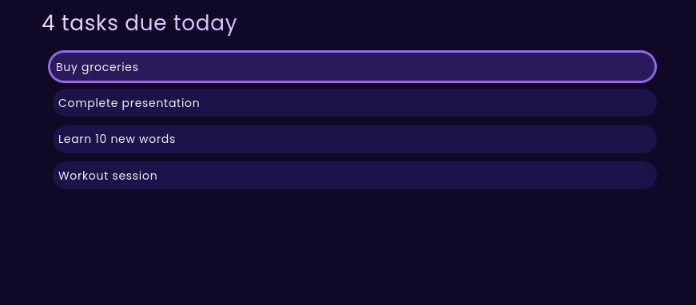

# Todo-app

A simple, keyboard-controlled task management app built with React and TailwindCSS. Navigate, create, edit, and delete tasks seamlessly without ever using a mouse!

## Demo

Explore the live demo [here](https://todo-app-sepia-pi-63.vercel.app/).<br>


## Features

- **Keyboard-First Control**: Perform all actions using intuitive keyboard shortcuts.
- **Minimalist Design**: Clean and focused UI for efficient task management.

## Keyboard Shortcuts

### Navigation
- `↓` or `j`: Focus the next task  
- `↑` or `k`: Focus the previous task  
- `1-9`: Focus the nth task  
- `Home` or `u`: Focus the first task  
- `End` or `i`: Focus the last task  

### Task Management
- `n`: Create a new task  
- `e`: Edit the focused task  
- `d`: Remove the focused task  

## Installation

Follow these steps to set up the app locally:

1. Clone the repository:  
   ```bash
   git clone https://github.com/dexi22/todo-app.git
   ```
2. Navigate to the project directory:
   ```bash
   cd todo-app
   ```
3. Install dependencies:
   ```bash
   npm install
   ```
4. Start the development server:
   ```bash
   npm start
   ```

## Feedback

This is a learning project, but feel free to open an issue if you have suggestions.
